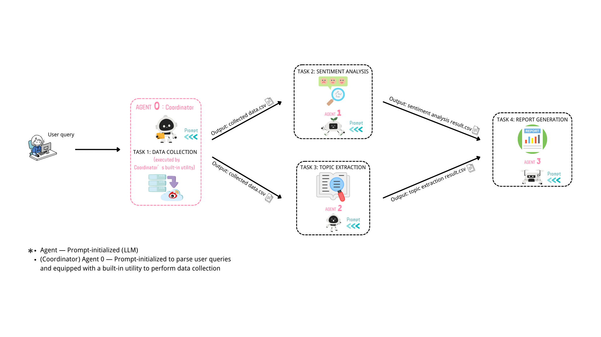

# POAP: An End-to-end Public Opinion Analysis Pipeline for Weibo

**POAP** is an end-to-end, agentic pipeline designed for **automated public opinion analysis on Weibo**, combining web crawling, sentiment detection, keyword-based topic modeling, and report generation — all coordinated by a central multimodal agent.

## 🛠️ System Overview

POAP consists of five modular agents orchestrated by a central coordinator:

- **🧭 Coordinator Agent**  
  Interacts with the user to determine which event to analyze and specifies the relevant time window.

- **🌐 Crawler Agent**  
  Collects Weibo posts and user comments related to the specified topic using targeted keyword search and time filters.

- **💬 Sentiment Analysis Agent**  
  Analyzes each comment's emotional tone using a fine-tuned sentiment classifier (positive/neutral/negative).

- **🧠 Topic Modeling Agent**  
  Extracts key themes and representative keywords from the dataset via keyword clustering and frequency analysis.

- **📝 Report Writer Agent**  
  Generates a comprehensive, human-friendly report summarizing the sentiment trends and discussion topics, enriched with examples and statistical plots.

This modular, agent-based architecture supports flexible deployment, easy extension, and interpretable result generation across diverse domains of online public opinion analysis.

## 🚧 Coming Soon

- Web UI for human-in-the-loop analysis  
- Integration with other Chinese social media platforms (e.g., Douyin, Zhihu)
